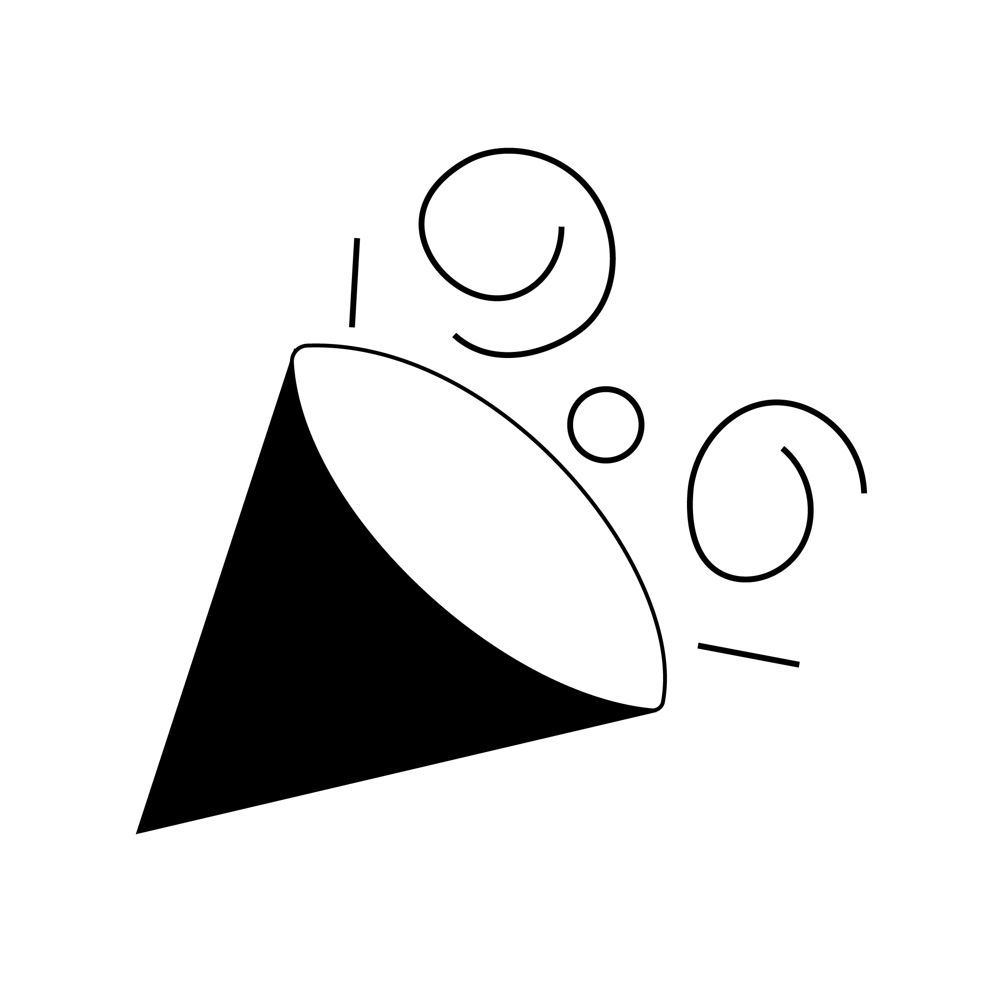

  
   
<!--    -->
  
  

  

# Wings
Wings is your passport to unforgettable experiences. Elevate your event journey with our all-in-one showcase and booking app. Explore a world of diverse events, from concerts to conferences, and unlock seamless ticketing and scheduling. With Wings, you're not just an attendee; you're a VIP guest to a world of possibilities. So spread your Wings and let every moment take flight.

Discover, book, and soar with Wings today! 🌟

## 🚀 Platform Versions
**Wings** is powered by the magic of Flutter and Dart. To embark on this exciting journey, make sure you're equipped with the right versions:
- **Flutter**: v3.10.5 or higher 🦋
- **Dart**: 3.0.5 or higher 🎯

Don't worry, if you're not up to speed yet, it's easy to upgrade! Just visit the [Flutter](https://flutter.dev/docs/get-started/install) and [Dart](https://dart.dev/get-dart) websites to get the latest versions.

Let's flutter and dart our way to greatness together! 🌟

## Contribution
🚀 We believe in the power of collaboration and welcome contributions from our amazing community to make **Wings** even more awesome!

Whether you're a developer, designer, or just an enthusiast, you can contribute in various ways:

* 💡 Feature Ideas: Have a cool feature in mind? Share your ideas with us. We love fresh perspectives!
* 🐛 Bug Reports: Spotted a bug? Let us know! Help us squash those pesky little critters.
* 📖 Documentation: Improve our documentation. Clear and concise docs make a world of difference.
* 🛠 Code Contributions: If you're a developer, dive into the codebase. Tackle open issues or implement new features.
* 💬 Community Support: Share your knowledge! Help others by answering questions and engaging in discussions.
* ✏️ Design: If you have design skills, contribute by enhancing our UI/UX.

Dig into [**CONTRIBUTING.MD**](CONTRIBUTING.md), which covers submitting bugs, requesting new features, preparing your code for a pull request, etc.

Please don't forget to **like**, **follow**, and **star our repo**!.

## Bugs or Requests
If you encounter any problems feel free to open an [issue](https://github.com/zeeshanayaz/wings_event_app/issues/new?template=bug_report.md). If you feel the library is missing a feature, please raise a [ticket](https://github.com/zeeshanayaz/wings_event_app/issues/new?template=feature_request.md). Pull request are also welcome.

## License
This package is available under the [**MIT License**](LICENSE).
